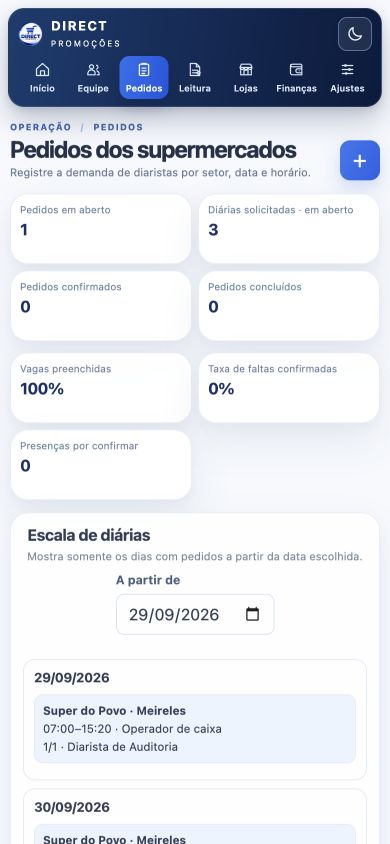
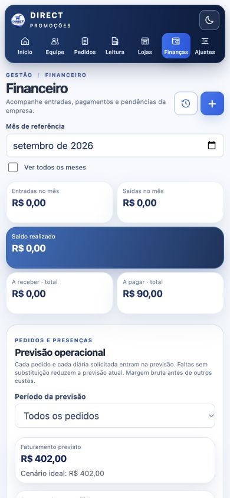
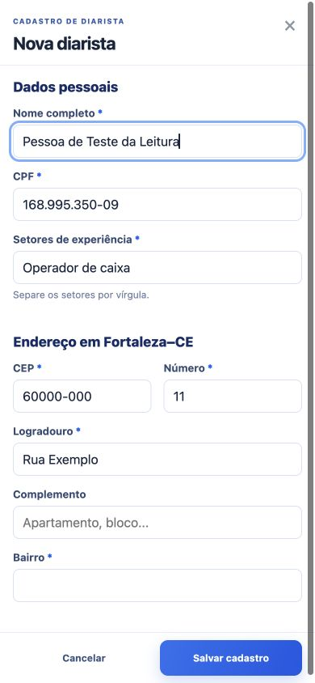
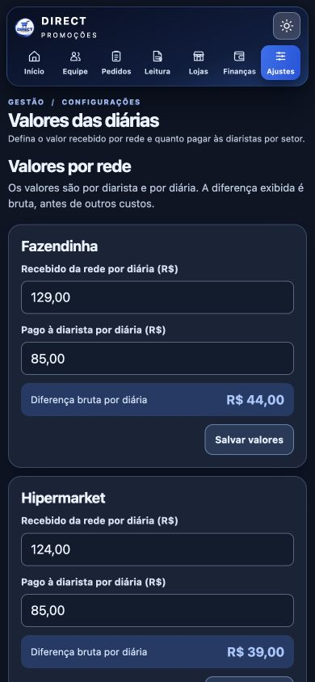

# Auditoria do Sistema Direct Promoções — 29/09/2026

## Resultado

**Nota: 8/10.** O fluxo principal de cadastro → pedido → escala → presença/falta → financeiro está integrado e passou nos testes locais. A nota considera as limitações de validação em produção e os pontos de segurança e acessibilidade descritos abaixo. Não é uma garantia de ausência de falhas.

Os dados reais não foram alterados. As operações de teste usaram uma base SQLite temporária; a base Supabase de produção foi consultada somente para leitura.

## Percurso verificado

| Etapa | Estado | Evidência |
| --- | --- | --- |
| 1. Login e permissões | Parcial | Site publicado pede login; acesso anônimo às tabelas de pessoal, pedidos, financeiro e equipe retornou HTTP 401. Uma sessão administrativa autenticada permitiu conferir as telas de produção em modo de leitura; os demais perfis não foram testados. |
| 2. Diaristas | OK no ambiente local | Cadastro, ficha, histórico, disponibilidade específica e bloqueio foram testados. CPF e CEP são validados. |
| 3. Pedidos e redes | OK no ambiente local | Pedido vincula rede e loja do catálogo, mostra o endereço na ficha e abre a loja correspondente. Os oito pedidos existentes em produção apontam para redes e lojas cadastradas. |
| 4. Escala semanal | OK no ambiente local | A atribuição da mesma pessoa a todos os dias possíveis do pedido criou três escalas. A escala mostra apenas dias com pedido e permite avançar páginas. |
| 5. Presença/falta e financeiro | OK no ambiente local | Uma presença criou diária pendente de R$ 90; uma falta retirou a diária e reduziu a previsão de R$ 402 para R$ 268. Pedido cancelado com uma presença conservou R$ 134 de faturamento e R$ 90 de custo realizados. |
| 6. Leitura IA | Parcial | Texto e revisão de pendência foram testados. Ao completar o cadastro, a pendência foi baixada e o horário específico de 07:00–15:20 foi preservado. OCR de foto e PDF não foi exercitado nesta rodada. |
| 7. Interface móvel | OK nos tamanhos simulados | Sete abas avaliadas em 390 × 844 e 320 × 844, em temas claro e escuro. Nenhuma página apresentou rolagem horizontal; campos de digitação ficaram em 16 px; todos os sete destinos de navegação ficaram visíveis. Falta teste em Safari de iPhone real para afirmar que não haverá zoom. |

## Correções desta rodada

1. **Pedidos ↔ redes/lojas/configurações:** sugestões de rede, loja e setor no formulário; conferência do endereço; acesso direto à loja cadastrada.
2. **Pedidos ↔ diaristas:** botão “Ver ficha” em cada pessoa escalada. A ficha do pedido deixou de solicitar cadastros de diaristas para o perfil de consulta, que não tem essa permissão.
3. **Financeiro ↔ pedidos:** cada pedido da previsão agora pode ser aberto pelo financeiro.
4. **Leitura IA ↔ cadastros:** a revisão preserva o modo de horários específicos; ao salvar um registro revisado, a pendência correspondente é resolvida automaticamente.
5. **Datas abreviadas:** “29 a 30” termina no mesmo mês; “29 a 04” continua no mês seguinte.
6. **Previsão:** pedidos cancelados deixam de projetar diárias futuras, mas mantêm presenças já realizadas e os valores registrados nelas.
7. **Móvel:** navegação compacta com as sete abas acessíveis sem deslizar horizontalmente; troca de aba volta ao topo.

## Testes e segurança

- **15 testes Python e 9 testes JavaScript passaram**, incluindo cadastro, bloqueio, validações, pedidos, tarifas, presenças, pagamento, leitura, datas abreviadas e previsão.
- O percurso interativo local cobriu pedido com três datas, atribuição em todos os dias, presença, falta, cancelamento, ficha da diarista, endereço da loja e valores no financeiro.
- Na produção autenticada, o financeiro carregou oito pedidos e 55 diárias solicitadas, com faturamento previsto de R$ 7.370, custo previsto de R$ 4.950 e margem bruta prevista de R$ 2.420. Esses números foram observados, sem gravações na base real.
- As 12 tabelas públicas do Supabase inspecionadas têm Row Level Security habilitado. Não foi encontrada política de leitura irrestrita para `anon`; requisições anônimas às tabelas sensíveis testadas retornaram HTTP 401.
- O Security Advisor do Supabase indicou **proteção contra senhas vazadas desativada**. A configuração de autenticação precisa ser revista no painel Supabase conforme a disponibilidade no plano atual. O Performance Advisor indicou avisos de políticas RLS e índices não utilizados; eles não bloquearam os testes, mas merecem revisão antes de um aumento relevante de uso.
- A inspeção visual local não encontrou erros ou avisos no console do navegador.

## Telas verificadas

## Próximas atualizações gratuitas

1. Testar os fluxos diretamente na produção com contas de cada perfil (admin, operação, financeiro e consulta), incluindo gravações controladas e reversíveis aprovadas para esse fim.
2. Testar foto e PDF reais na Leitura IA, inclusive arquivos pouco legíveis e PDF digitalizado, e melhorar as mensagens de revisão quando a confiança do OCR for baixa.
3. Validar o uso em Safari de iPhone e Android Chrome, com teclado aberto, rotação de tela e zoom de acessibilidade.
4. Reforçar rotina de exportação e restauração de backup e ensaiar uma recuperação em base isolada.
5. Adicionar testes automatizados de navegação e permissões por perfil ao fluxo de publicação.
6. Revisar os avisos do Supabase Security/Performance Advisor e ativar a proteção contra senhas vazadas se estiver disponível sem custo adicional.

## Limites da auditoria

Não foram feitas mudanças na base de produção. A sessão administrativa permitiu leitura das telas publicadas, mas não foram testadas gravações no site publicado nem os demais perfis. A responsividade foi medida por viewport simulado; o comportamento real de zoom no Safari depende de ensaio no aparelho. Fotos e PDFs da Leitura IA não foram processados neste teste.
